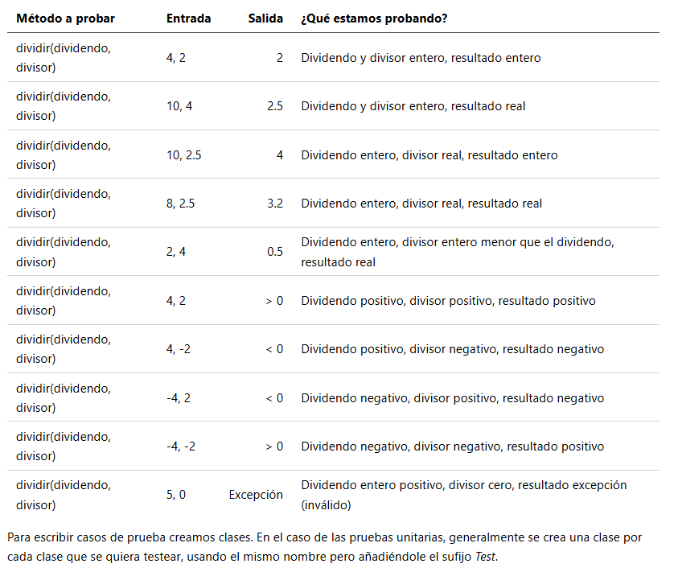
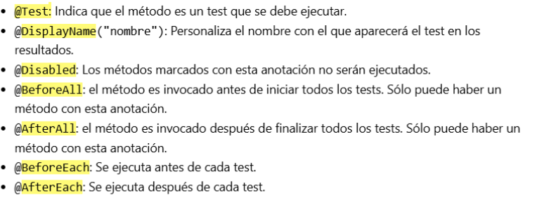
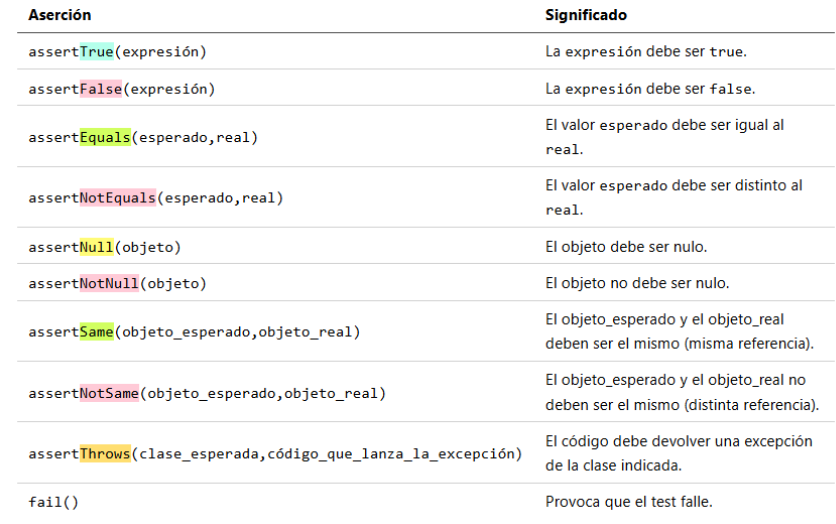
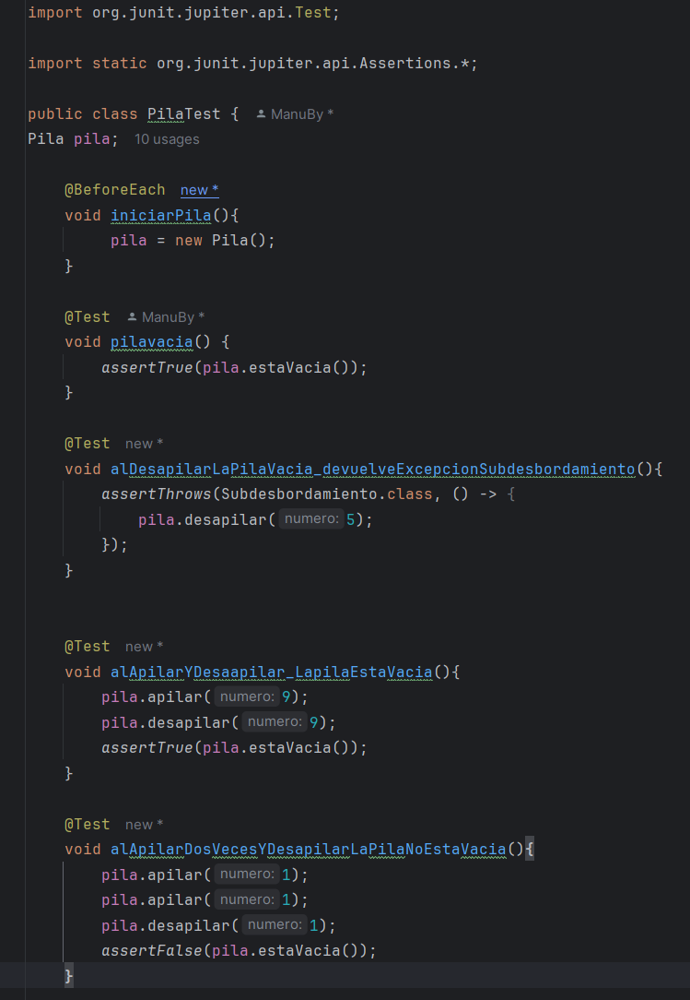
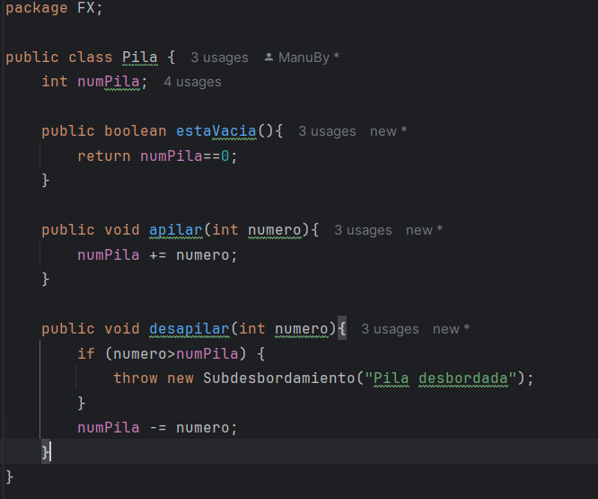
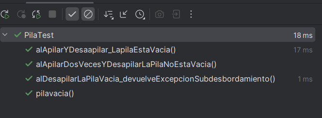

# Unidad 5 PRUEBAS

### 1. Introducción

Una prueba o test es una ejecución controlada de nuestro software que se lleva a cabo en unas condiciones concretas y para la que se comprueba que el resultado de la ejecución coincide con el esperado.

Una buena prueba debe tener dos objetivos:

* Comprobar **si el software no hace lo que debe hacer**.
* Comprobar **si el software hace algo que no debe hacer**.

En este tema vamos a profundizar en los tipos de pruebas existentes y su funcionamiento, para posteriormente poner en práctica lo aprendido con un pequeño proyecto.

### 2. Pruebas

**2.1. Forma de las pruebas**

* Pruebas dinámicas: requieren ejecutar el programa.
* Pruebas estáticas: se hacen sin ejecutar el código, examinándolo directamente.

**2.2. Estrategias de prueba**

Caja negra:

* Se prueba el sistema desde fuera, sin conocer el código interno.
* Se analiza la respuesta del sistema ante distintas entradas.
* Técnicas principales:
  * Particiones de equivalencia: dividir las entradas en clases válidas e inválidas.
  * Análisis de valores límite: probar con valores justo dentro y fuera de los rangos aceptados.

Caja blanca:

* Se analiza el funcionamiento interno del código.
* Técnicas principales:
  * Cobertura de código: probar todas las sentencias, decisiones y caminos.
  * Prueba de bucles: probar el comportamiento del bucle con 0, 1, 2, n-1, n y n+1 iteraciones.

**2.3. Tipos de pruebas**

Funcionales:

* Pruebas unitarias: comprueban funciones o clases individualmente.
* Pruebas de regresión: se hacen tras cambios para asegurar que no se introducen errores nuevos.
* Pruebas de integración: comprueban que los distintos módulos funcionan juntos.
* Pruebas de humo: rápidas, para detectar errores graves.
* Pruebas del sistema: prueban el sistema completo.
* Pruebas alfa: realizadas por el equipo de pruebas, con versiones inestables.
* Pruebas beta: hechas por usuarios reales, con versiones más estables.
* Pruebas de aceptación: hechas por el cliente para validar si se cumplen los requisitos.

No funcionales:

* Pruebas de usabilidad: valoran si el software es fácil de usar.
* Pruebas de rendimiento: miden la rapidez del programa.
* Pruebas de estrés: comprueban el comportamiento bajo mucha carga.
* Pruebas de seguridad: evalúan vulnerabilidades.
* Pruebas de compatibilidad: analizan el funcionamiento en diferentes entornos.
* Pruebas de portabilidad: determinan si el software se puede adaptar a otros entornos.

**2.4. Mecanismos de prueba**

* Manual: realizadas por personas.
* Automático: realizadas por software que compara resultados obtenidos y esperados.

### 3.Debug

Para realizar el proceso de debug se debe ejecutar el programa en un modo especial (modo debug) para que pueda ser controlado. El programa encargado de controlar su ejecución recibe el nombre de **debugger**.

Previamente a lanzar la ejecución o durante esta, podemos definir **puntos de ruptura (break points)**. Son líneas de código en las que la ejecución se detendrá a la espera de nuestras instrucciones. Llegado este momento, podremos controlar la ejecución paso a paso, disponiendo normalmente de las siguientes opciones:

* Continuar la ejecución hasta el próximo punto de ruptura (o el final del programa).
* Ejecutar sentencia y pasar a la siguiente.
* Ejecutar sentencia actual paso a paso. Esta opción profundiza un nivel dentro del código y el código que pasamos a estar revisando es el interno de dicha sentencia.
* Terminar de ejecutar sentencia interna. Esta opción se utiliza al haber hecho uso de la anterior. Termina de ejecutar el código de la sentencia y pasa a la siguiente sentencia del programa que estábamos revisando en primer lugar.
* Terminar el programa.

**Automatización de pruebas**
A) Casos de prueba
Los casos de prueba generalmente se componen de entradas conocidas y salidas esperadas.

En la siguiente tabla tenemos un ejemplo de casos de prueba para un método que divide un número entre otro:

B) Anotaciones
En las clases tenemos test podemos crear métodos que implementen los tests. Para ello podemos usar las siguientes anotaciones:

C) Aserciones
En los métodos de la clase test utilizamos aserciones para indicar afirmaciones que deben cumplirse para que el test sea correcto

### 4. TDD

**TDD** (**Test Driven Design**) es una metodología de desarrollo que pone a las pruebas en el centro del desarrollo de software, proponiendo que primero se diseñen estas y luego se programe, no con el fin de desarrollar una funcionalidad concreta, sino con el de conseguir que el software pase el test.

De esta manera, aunque el desarrollo en un principio se ralentice, se consigue un software robusto con una cobertura de código del 100% que tendrá un coste de mantenimiento menor. Además, al refactorizar constantemente, el código será de mayor calidad.

Este método se resume en los siguientes pasos:

* Escoge el requisito sin implementar más sencillo y escribe un test que compruebe si este se cumple (fase roja). Evidentemente este test fallará.
* Implementa el código que haga que el programa pase el test (fase verde).
* Refactoriza el código (fase azul):

  * Busca malos olores (*code smells*) y elimínalos.
  * Busca duplicidades y elimínalas.
  * Comprueba que el código cumpla con los principios SOLID.
  * Trata de hacer el código más claro y mantenible.
* Ejecuta los tests para comprobar que la refactorización no ha introducido algún bug.
* Vuelve al punto 1 mientras queden requisitos sin cumplir.

### 5. PUESTA EN PRÁCTICA

Vamos a poner en práctica lo aprendido con el proyecto Pila. A continuación se muestran los test que vamos a llevar a cabo, y el modelo que he creado para cumplir con los tests necesarios. El proycto está incluído en el repositorio.

TESTS:

MODELO:

RESULTADOS:

