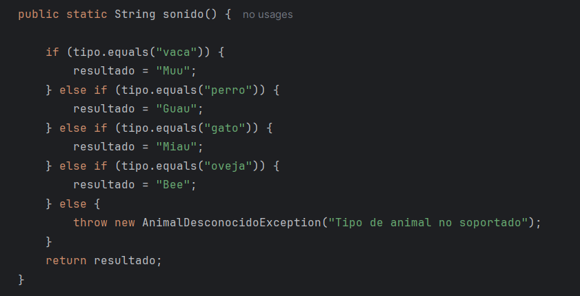
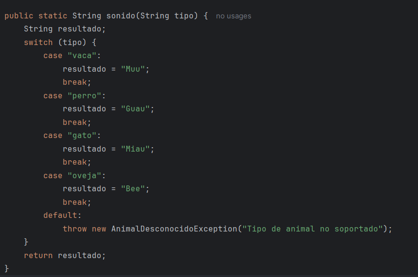

# UD.6 Optimización y refactorización de código

En el proceso de desarrollo, la optimización y refactorización es un paso imprescindible. El trabajo no termina una vez funciona el código, sino cuando además de funcionar, el código es lo suficientemente limpio y coherente. Para ello, debemos buscar lo que llamamos "code smells", código que no tiene buena pinta a simple vista, y eliminarlos.

### 6.1 Refactorización

Las refactorizaciones son estrategias para reestructurar el código de forma que se resuelva un problema de diseño sin cambiar su funcionamiento. Utilizando estas estrategias podemos solucionar los code smells que encontremos. Encontramos diferentes estrategias de refactorización.

#### - Composing Methods

Estas refactorizaciones se centran en crear métodos y reducir código duplicado.

#### - Incline Methods

Esta refactorización se da cuan do un método existente es muy evidente o muy simple. En estos casos se debe usar su código directamente en lugar del método, y eliminarlo si es posible.

#### - Moving features between objects

Estas refactorizaciones consisten en mover elementos entre clases.

#### - Move Field

Esta refactorización se da cuando hay un atributo que está más relacionado con otra clase que con la clase a la que pertenece. La refactorización consiste en mover dicho atributo de una clase a otra.

#### - Extract class

Esa refactorización se da cuando una clase realiza varios trabajos distintos entre sí.


#### - Replace Error Code with Exception

Esta refactorización se da cuando tenemos un método que devuelve un valor especial en caso de error.

```java
int retirarDinero(int cantidad) {
  if (cantidad > saldoEnCuenta) {
    return -1; // Devuelve -1 si la operación falla
  }
  else {
    saldoEnCuenta -= cantidad;
    return 0; // Devuelve 0 si la operación es correcta.
  }
}
```

La refactorización consiste en lanzar una excepción en lugar de devolver el valor especial.

```java
void retirarDinero(int cantidad) throws BalanceException {
  if (cantidad > saldoEnCuenta) {
    throw new BalanceException();
  }
  saldoEnCuenta -= cantidad;
}
```


#### - Simplifying Conditional Expressions

Estas refactorizaciones consisten en simplificar estructuras condicionales, que con el tiempo al crecer tienden a complicarse cada vez más.

##### Replace Nested Conditional with Guard Clauses

Si hay condicionales anidados a veces es complicado ver por dónde va el flujo de ejecución.

```java
public double getTarifa() {
  double resultado;
  if (isFamiliaNumerosa){
    resultado = getTarifaFamiliaNumerosa();
  }
  else {
    if (isJubilado){
      resultado = getTarifaJubilado();
    }
    else {
      if (isEstudiante){
        resultado = getTarifaEstudiante();
      }
      else{
        resultado = getTarifaEstandar();
      }
    }
  }
  return resultado;
}
```

Esta refactorización propone mover todas las comprobaciones especiales y particulares a comprobaciones individuales al inicio, y dejar el caso principal o más frecuente al final.

```java
public double getTarifa() {
  if (isFamiliaNumerosa){
    return getTarifaFamiliaNumerosa();
  }
  if (isJubilado){
    return getTarifaJubilado();
  }
  if (isEstudiante){
    return getTarifaEstudiante();
  }
  return getTarifaEstandar();
}
```


### 2.1.2 Code smells

Un code es un indicio de que algo podría estar mal en el código, aunque no sea un error que impida su ejecución. Es decir, no rompe el programa, pero sugiere que puede mejorarse porque:

* Es difícil de entender.
* Es difícil de mantener o extender.
* Viola principios de diseño (como SOLID).
* Podría generar errores en el futuro.

Cuando veamos este tipo de "olores" es importante no dejarlos pasar y corregirlos para que el código sea lo más limpio posible. Algunos ejemplos de code smells:

##### - Long Method

Este code smell se da en métodos que contienen demasiadas líneas de código, o que realizan varias funciones. Se suele decir que unas 50 líneas ya es demasiado código, pero lo importante más que las líneas que tenga es el que realice distintas tareas. Un método largo es dificil de entender. Siempre será mejor dividir las el método en funciones separadas.

```c#
//list of available smartphone results
List<string> smartphones = new List<string>()
    {
    "Samsung Galaxy S20",
    "Pixel 2",
    "Pixel 3",
    "Pixel 4",
    "iPhone XR",
    "iPhone 12",
    "iPhone 12 Pro",
    "iPhone 12 Pro Max"
    };
 
//long method that we will refactor
public void PerformSearch()
{
    bool continueSearch = true;
 
    while (continueSearch)
    {
        //user enters the term
        Console.Write("Search for smartphone: ");
        string keyword = Console.ReadLine();
 
        var results = smartphones
            .Where(phone => phone
                                .ToLower()
                                .Contains(keyword.ToLower()));
        //if there are resuls, they are displayed in the output
        if (results != null)
        {
            Console.WriteLine("Here are the matched results.\n");
 
            foreach (var result in results)
            {
                Console.WriteLine(result);
            }
        }
        else
        {
            Console.WriteLine("No results found.");
        }
 
        //this asks user if he wants to search again
        //valid responses are Y and N
        //the program stops if the answer is N
        string continueSearchResponse;
        do
        {
            Console.Write("\nMake another search (y/n)?: ");
            continueSearchResponse = Console.ReadLine();
 
            if (continueSearchResponse.ToLower() == "n")
            {
                continueSearch = false;
                break;
            }
            if (continueSearchResponse.ToLower() != "y")
            {
                Console.WriteLine("Invalid response.");
            }
 
        } while (continueSearchResponse.ToLower() != "n"
                 && continueSearchResponse.ToLower() != "y");
    }
 
    Console.Write("Thanks for searching!");
}
```

Si lo dividemos en funciones, quedaría tan limpio como esto:

```c#
public void PerformSearch()
{
    bool continueSearch = true;
 
    while (continueSearch)
    {
        SearchForSmartphones();
 
        continueSearch = ShouldContinueWithSearch(continueSearch);
    }
 
    Console.Write("Thanks for searching!");
}
```


##### - Conditional Complexity / Switch Statements

Este code smell se da cuando se usa la estructura switch (o una estructura condicional similar), ya que:

* En grandes aplicaciones el mismo switch, con los mismos casos, puede aparecer en varios lugares, y si hay que modificarlo debería hacerse en todos lados.
* Si hay que añadir un nuevo caso al switch, habrá que hacerlo en todas sus ocurrencias.

```java
class Bird {
  // ...
  double getSpeed() {
    switch (type) {
      case EUROPEAN:
        return getBaseSpeed();
      case AFRICAN:
        return getBaseSpeed() - getLoadFactor() * numberOfCoconuts;
      case NORWEGIAN_BLUE:
        return (isNailed) ? 0 : getBaseSpeed(voltage);
    }
    throw new RuntimeException("Should be unreachable");
  }
}
```

Este code smell empezó aplicándose a estructuras switch, pero también se puede aplicar a estructuras condicionales equivalentes:

```java
class Bird {
  // ...
  double getSpeed() {
    if (type == EUROPEAN) {
        return getBaseSpeed();
    } else if (type == AFRICAN) {
        return getBaseSpeed() - getLoadFactor() * numberOfCoconuts;
    } else if (type == NORWEGIAN_BLUE) {
        return (isNailed) ? 0 : getBaseSpeed(voltage);
    } else {
        throw new RuntimeException("Should be unreachable");
    }
  }
}
```

La solución recomendada es reemplazar el condicional por polimormismo. Como regla general, cuando vayas a usar switch deberías pensar en polimorfismo.

```java
abstract class Bird {
  // ...
  abstract double getSpeed();
}

class European extends Bird {
  double getSpeed() {
    return getBaseSpeed();
  }
}
class African extends Bird {
  double getSpeed() {
    return getBaseSpeed() - getLoadFactor() * numberOfCoconuts;
  }
}
class NorwegianBlue extends Bird {
  double getSpeed() {
    return (isNailed) ? 0 : getBaseSpeed(voltage);
  }
}

// Somewhere in client code
speed = bird.getSpeed();
```

##### - Shotgun surgery

Este code smell consiste en que para hacer un cambio necesitemos hacer muchos cambios pequeños en clases o métodos diferentes.

```java
class Minion {
    private int energy;

    void attack() {
        if (energy < 20) {
            animate('no-energy');
            skip_turn();
            return;
        }
      
        ...
    }

    void cast_spell() {
        if (energy < 50) {
            animate('no-energy');
            skip_turn();
            return;
        }
      
        ...
    }

    void block() {
        if (energy < 10) {
            animate('no-energy');
            skip_turn();
            return;
        }
      
        ...
    }

}
```

Esto ocurre porque una responsabilidad se ha repartido entre varias clases o métodos. La solución recomendada consiste en mover los métodos o atributos a una sola clase o método. Si no existe una clase o método apropiado, crea una.

```java
class Minion {
    private int energy;

    void attack() {
        if (!has_enough_energy(20)) {
            return;
        }
      
        ...
    }

    void cast_spell() {
        if (!has_enough_energy(50)) {
            return;
        }
      
        ...
    }

    void block() {
        if (!has_enough_energy(10)) {
            return;
        }
      
        ...
    }

    boolean void has_enough_energy(int energy_required) {
        if (energy < energy_required) {
            handle_no_energy();
            return false;
        }
        return true;
    }

    void handle_no_energy() {
        animate('no-energy');
        skip_turn();
    }
}
```

Si alguna clase o método, al hacer esto, queda prácticamente vacío, puedes intentar eliminarla usando Inline Class o Inline Method.


##### Duplicated Code

El código duplicado es un code smell por dos razones principales:

* Ocurre muchas veces que para realizar algo copiamos y pegamos código y lo adaptamos un poco para que cumpla con nuestro cometido. Al hacer esto es posible que sea un código que no entendamos completamente, y que puede estar haciendo algo innecesario, o que tenga algún fallo que estamos propagando.
* Si el día de mañana es necesario modificar ese código, deberá hacerse en todas las partes donde se haya duplicado. Es posible que no recuerdes todos los lugares donde lo has copiado, lo que llevaría a no poder actualizar dichas copias.

Una posible solución es usar el patrón de refactorización "Extraer método" para mover el código a un nuevo método que puedas llamar desde varios sitios.


### Ejercicio. Corrección de code smells



En este código vemos un claro caso de anidamiento de ifs innecesario. Creo que podríamos dejar el código mucho más limpio cambiando la estructura a in swicht:



